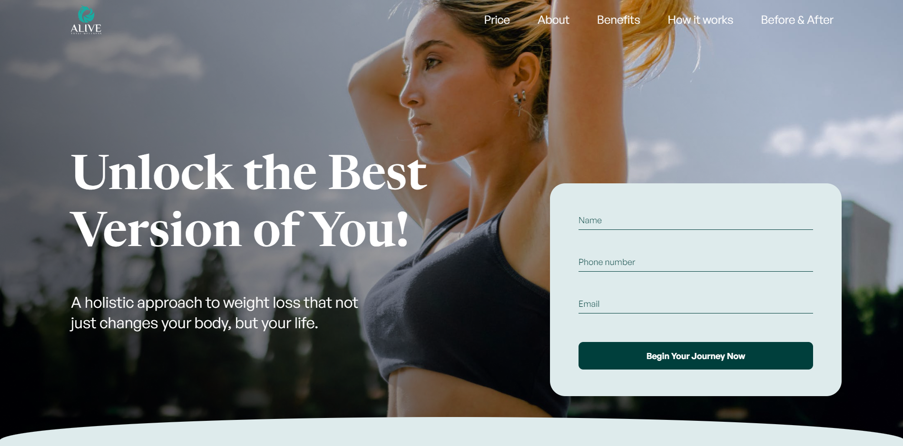
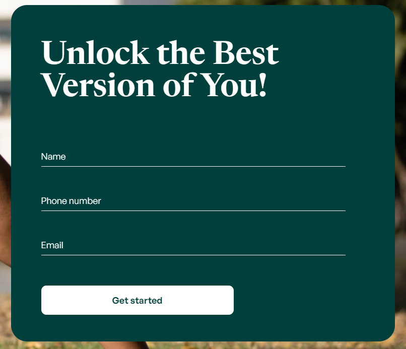

# Alive total wellness (real order)

[Here you can check it](https://artemuholkov.github.io/ALIVE-total-wellness/)

---

I had figma design for this project.
This landing page is 100% responsive for all types of screens.
I used HTML, CSS, JS in this project.

---

### What was interesting in this project:

1. Interesting view of main section.

2. Before - after section. Image changing on hover. I used pre-created libraty to make it. Slider created with swiperjs

3. Questions section created with boostrap

4. Form sending data to owners email

